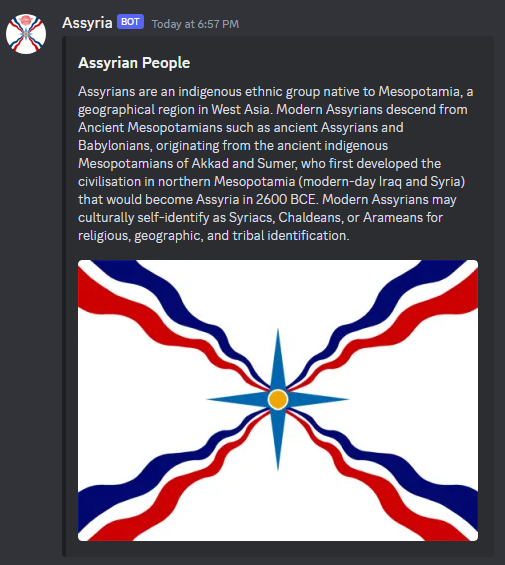

# AssyriaBot

AssyriaBot is a discord bot that can fetch Bible verses based on user input. It provides a simple interface to look up Bible verses by book, chapter, and verse.

It also provides information about Assyria and Assyrians. This was created for Assyrian based discord communities to bring recognition to the Assyrian people, their culture and their rich ancient history.

This git includes two variants, the Python version or a Ruby version - they are not the same.

* The **Python** version uses the `https://bible-api.com/` website and API calls to get the information.
* The **Ruby** version uses an offline XML file called `eng-web.usfx.xml` (included). This version is currently limited to 2 different variations of calls (more information below).

This git also includes Docker image for ease of running.

## Setup

1. Clone the repository.

2. Set up a Discord bot and obtain its token. You can find instructions on how to do this here: [Creating a Bot Account](https://discord.com/developers).

3. Install dependencies:
   * For Python, you can use pip:
     ```
     pip install -r requirements.txt
     ```
   * For Ruby, you can use bundler:
     ```
     bundle install
     ```

4. Create a `.env` file in the root directory and add your bot token:

```
API_KEY=
BOT_TOKEN=
CHANNEL=
CLIENT_ID=
```

## Usage

### Python

* Run the Python script:

```
python main.py
```

* The bot will listen for commands prefixed with `!`. For example:

  * Single Verses: `!bible john 3:16`
  * Entire Chapter: `!bible john 3`
  * Abbreviated book name: `!bible jn 3:16`
  * Verse range: `!bible romans 12:1-2`
  * Multiple ranges: `!bible romans 12:1-2,5-7,9,13:1-9&10`
  * Random verse: `!bible random`

* The bot will respond with the requested Bible verse.

### Ruby

* Run the Ruby script:

```
ruby main.rb
```

* The bot will listen for commands prefixed with `!`. For example:

  * Single Verses: `!bible John 3:16`
  * Entire Chapter: `!bible John 3`

**Note: Capitalisation in the Ruby variant is important.**

* The bot will respond with the requested Bible verse.

### Docker

Both the Python and Ruby code have Dockerfiles included in the repository. You can use Docker to run the bot in a containerized environment.

#### Python Dockerfile

```
# Use an official Python runtime as a parent image
FROM python:3.8

# Set the working directory inside the container
WORKDIR /app

# Copy the requirements file into the container
COPY requirements.txt .

# Install any needed packages specified in requirements.txt
RUN pip install -r requirements.txt

# Copy the rest of your application code into the container
COPY . .

# Define the command to run your bot
CMD ["python", "main.py"]
```

To build the Docker image and run the container:

```
docker build -t AssyriaBotPython -f Dockerfile\(Python\) .
docker run -it AssyriaBotPython
```

#### Ruby Dockerfile

```
# Use the official Ruby image from the Docker Hub
FROM ruby:3.1

# Set the working directory in the container
WORKDIR /usr/src/app

# Install required gems
COPY Gemfile Gemfile.lock ./
RUN bundle install

# Copy the Ruby script and XML file into the container
COPY . .

# Run the Ruby script
CMD ["ruby", "main.rb"]
```

To build the Docker image and run the container:

```
docker build -t AssyriaBotRuby -f Dockerfile\(Python\) .
docker run -it AssyriaBotRuby
```

## Assyria

AssyriaBot also includes the `!assyria` command that provides some information about Assyrians and the Assyrian flag in a neat embed.



More Assyrian based commands to come!

## Contributing

Pull requests are welcome. For major changes, please open an issue first to discuss what you would like to change.

Please make sure to update tests as appropriate.

## License

This project is licensed under the terms of the GNU General Public License v3.0. For more information, please visit [GNU General Public License](https://www.gnu.org/licenses/gpl-3.0.html).
