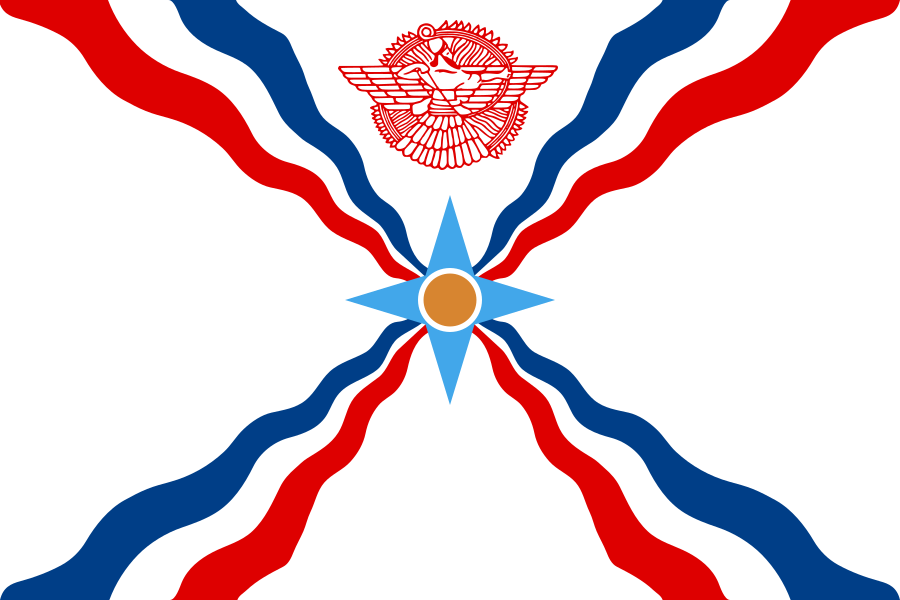

# AssyriaBot

AssyriaBot is an exclusive bot for the [r/Assyria](https://discord.gg/r-assyria-247923889697587200) Discord community. It provides various features aimed at enhancing the community's experience and promoting Assyrian culture and heritage.

<figure>
    
    <figcaption>Assyrian Flag</figcaption>
</figure>

## AlapBet Quiz

AssyriaBot implements an interactive AlapBet quiz game using Discord's API. The AlapBet quiz aims to educate users about Assyrian characters and their descriptions. Users can initiate the quiz in their own channel, where they will encounter multiple-choice questions related to various characters from Assyrian history and culture.

This is being expanded into various levels of increasing difficulty.

## Information Hub

In addition to the AlapBet quiz, AssyriaBot serves as an information hub about Assyria and Assyrians. It provides resources and insights into Assyrian culture, history, and heritage. This feature was created to foster recognition of the Assyrian people and their rich ancient history within the [r/Assyria](https://discord.gg/r-assyria-247923889697587200) Discord community.

## Setup

At this present time it is not being developed for public use, rather being used as a repository for shared experience with likeminded individuals who wish to contribute to this project for the [r/Assyria](https://discord.gg/r-assyria-247923889697587200) Discord community.

## Data Privacy

AssyriaBot relies on external data sources to build lessons and quizzes within the Discord server. To maintain the integrity and exclusivity of the data, it is not publicly available. This approach ensures that users within the [r/Assyria](https://discord.gg/r-assyria-247923889697587200) Discord community have access to unique and curated content tailored to their interests.

## Contributing

Contributions to AssyriaBot are welcome! If you have ideas for new features, improvements, or fixes, feel free to fork this repository and submit pull requests. Your contributions help enhance the functionality and experience of the bot for the entire community.

## License

This project is licensed under the terms of the GNU General Public License v3.0. For more information, please visit [GNU General Public License](https://www.gnu.org/licenses/gpl-3.0.html).
